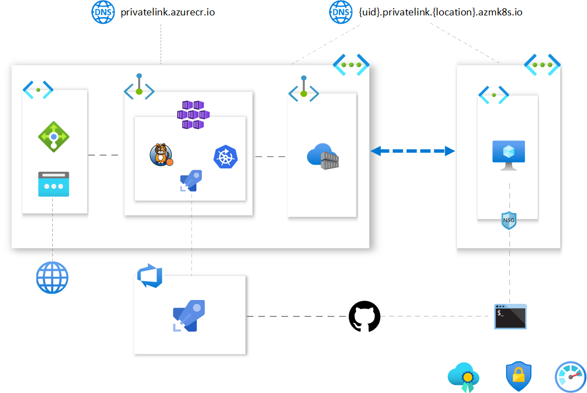

[](https://dev.azure.com/mabenoit-ms/MyOwnBacklog/_build/latest?definitionId=97?branchName=master)

# myakscluster

To properly setup and secure your AKS cluster, there is a couple of features and components to enable in order to properly setup your Security Posture, here is the list:

Basic - without cost:
- [ ] Managed Identity [#62](https://github.com/mathieu-benoit/myakscluster/issues/62)
- [X] Azure Lock [#21](https://github.com/mathieu-benoit/myakscluster/issues/21)
- [X] kured [#13](https://github.com/mathieu-benoit/myakscluster/issues/13)
- [X] Disable K8S Dashboard [#24](https://github.com/mathieu-benoit/myakscluster/issues/24)
- [X] Network Policy with Calico [#9](https://github.com/mathieu-benoit/myakscluster/issues/9)
- [ ] AAD [#10](https://github.com/mathieu-benoit/myakscluster/issues/10)
- [ ] Azure Policy for AKS [#11](https://github.com/mathieu-benoit/myakscluster/issues/11)
- [X] Azure KeyVault for Azure pipelines [#3](https://github.com/mathieu-benoit/myakscluster/issues/3)

Advanced - with cost:
- [X] Private AKS cluster + Private ACR + Jumpbox [#57](https://github.com/mathieu-benoit/myakscluster/issues/57)
- [ ] Limit Egress Traffic [#16](https://github.com/mathieu-benoit/myakscluster/issues/16)

Complementary Azure services to leverage:
- Azure Advisor for AKS
- Azure Security Center for ACR
- Azure Security Center for AKS



# Setup

```
#az account list -o table
#az account set -s <subscriptionId>
subscriptionId=$(az account show --query id -o tsv)
tenantId=$(az account show --query tenantId -o tsv)
spName=<spName>
spSecret=$(az ad sp create-for-rbac -n $spName --role Owner --query password -o tsv)
spId=$(az ad sp show --id http://$spName --query appId -o tsv)

location=<location>
kvName=<kvName>
rg=<rg>
az group create -n $rg -l $location
az keyvault create -l $location -n $kvName -g $rg
az keyvault secret set --vault-name $kvName -n subscriptionId --value $subscriptionId
az keyvault secret set --vault-name $kvName -n spTenantId --value $tenantId
az keyvault secret set --vault-name $kvName -n spId --value $spId
az keyvault secret set --vault-name $kvName -n spSecret --value $spSecret

az keyvault set-policy -n $kvName --spn $spId --secret-permissions get list

#https://devblogs.microsoft.com/devops/using-azure-devops-from-the-command-line/
az devops service-endpoint create --authorization-scheme ServicePrincipal
                                  --name
                                  --service-endpoint-type azurerm
                                  [--azure-rm-service-principal-id]
                                  [--azure-rm-subscription-id]
                                  [--azure-rm-subscription-name]
                                  [--azure-rm-tenant-id]
                                  [--detect {false, true}]
                                  [--org]
                                  [--project]
```

# Setup once the AKS cluster is provisioned

```
#Apply configs for Azure Monitor for Containers
kubectl apply -f container-azm-ms-agentconfig.yaml

#Install kured
kuredVersion=1.3.0
KURED_WEB_HOOK_URL=TO_REPLACE
kubectl create ns kured
helm repo add stable https://kubernetes-charts.storage.googleapis.com/
helm repo update
helm install kured stable/kured \
            -n kured \
            --set image.tag=$kuredVersion \
            --set nodeSelector."beta\.kubernetes\.io/os"=linux \
            --set extraArgs.start-time=9am \
            --set extraArgs.end-time=5pm \
            --set extraArgs.time-zone=America/Toronto \
            --set extraArgs.reboot-days="mon\,tue\,wed\,thu\,fri" \
            --set tolerations[0].effect=NoSchedule \
            --set tolerations[0].key=node-role.kubernetes.io/master \
            --set tolerations[1].operator=Exists \
            --set tolerations[1].key=CriticalAddonsOnly \
            --set tolerations[2].operator=Exists \
            --set tolerations[2].effect=NoExecute \
            --set tolerations[3].operator=Exists \
            --set tolerations[3].effect=NoSchedule \
            --set extraArgs.slack-hook-url=$KURED_WEB_HOOK_URL

# Install Azure Pipelines agent
AZP_TOKEN=REPLACE_ME
AZP_URL=https://dev.azure.com/REPLACE_ME
AZP_AGENT_NAME=REPLACE_ME
AZP_POOL=$AZP_AGENT_NAME

kubectl create secret generic azp \
  --from-literal=AZP_URL=$AZP_URL \
  --from-literal=AZP_TOKEN=$AZP_TOKEN \
  --from-literal=AZP_AGENT_NAME=$AZP_AGENT_NAME \
  --from-literal=AZP_POOL=$AZP_POOL
kubectl apply -f - <<EOF
apiVersion: apps/v1
kind: Deployment
metadata:
  name: ado-agent
spec:
  replicas: 1
  selector:
    matchLabels:
      app: ado-agent
  template:
    metadata:
      labels:
        app: ado-agent
    spec:
      containers:
        - name: ado-agent
          image: mabenoit/ado-agent:latest
          env:
            - name: AZP_URL
              valueFrom:
                secretKeyRef:
                  name: azp
                  key: AZP_URL
            - name: AZP_TOKEN
              valueFrom:
                secretKeyRef:
                  name: azp
                  key: AZP_TOKEN
            - name: AZP_AGENT_NAME
              valueFrom:
                secretKeyRef:
                  name: azp
                  key: AZP_AGENT_NAME
            - name: AZP_POOL
              valueFrom:
                secretKeyRef:
                  name: azp
                  key: AZP_POOL
          volumeMounts:
            - mountPath: /var/run/docker.sock
              name: docker-socket-volume
      volumes:
        - name: docker-socket-volume
          hostPath:
            path: /var/run/docker.sock
EOF
```

# Pricing estimation

- [AKS](https://azure.microsoft.com/pricing/details/kubernetes-service/)
  - Free.
- [Virtual Machines](https://azure.microsoft.com/pricing/details/virtual-machines/linux/) related to AKS worker nodes
  - Estimation: For 3 Standard_DS2_v2 Ubuntu worker nodes, ~ $xx USD/month
  - To decrease the cost: you may want to leverage [Azure Reserved VMs Instances](https://azure.microsoft.com/pricing/reserved-vm-instances/) to reduce the cost of your AKS worker nodes
- [Log Analytics Workspace](https://azure.microsoft.com/pricing/details/monitor/) (related to the Azure Monitor for Containers add-on)
  - Estimation: For xx GB/month, ~ $xx USD/month
  - To decrease the cost: you may want to leverage [logs filtering](https://docs.microsoft.com/azure/azure-monitor/insights/container-insights-agent-config), [retention by data type](https://docs.microsoft.com/azure/azure-monitor/platform/manage-cost-storage#retention-by-data-type) or [New capacity-based pricing option](https://azure.microsoft.com/updates/azure-monitor-log-analytics-new-capacity-based-pricing-option-is-now-available/).
- [Standard Load Balancer](https://azure.microsoft.com/pricing/details/load-balancer/)
  - Estimation: TODO
  - To decrease the cost: you may want to leverage Basic Load Balancer instead which is free but you won't be able to use Availability Zones nor VNET Peering features
- [Azure Firewall](https://azure.microsoft.com/pricing/details/azure-firewall/)
  - Estimation: TODO
- [Public IP](https://azure.microsoft.com/pricing/details/ip-addresses/)
  - Related to the SLB + FW
  - Estimation: TODO
- [Bandwidth](https://azure.microsoft.com/pricing/details/bandwidth/) (related to Availability Zones)
  - Estimation: TODO
  - Note: you may want to leverage PodAffinity to avoid cross-zones communications with Pods too chatty
- [Private Endpoint](https://azure.microsoft.com/pricing/details/private-link/)
  - Estimation: For 2 Private Endpoints (AKS + ACR)

# Other considerations:

- [Regulatory compliance](https://docs.microsoft.com/azure/aks/intro-kubernetes#regulatory-compliance)
- [Security hardening in AKS virtual machine hosts](https://docs.microsoft.com/azure/aks/security-hardened-vm-host-image)
- [Regularly update to the latest version of Kubernetes](https://docs.microsoft.com/azure/aks/operator-best-practices-cluster-security#regularly-update-to-the-latest-version-of-kubernetes)
- [Audit logging in AKS](https://azure.microsoft.com/updates/audit-logging-in-azure-kubernetes-service-aks-is-now-available/)
- [Azure AD PIM](https://docs.microsoft.com/azure/active-directory/privileged-identity-management/pim-configure)
- [Azure DDOS Protection](https://docs.microsoft.com/azure/virtual-network/ddos-protection-overview)
- Azure Front Door

# Resources

- [Attack matrix for Kubernetes](https://www.microsoft.com/security/blog/2020/04/02/attack-matrix-kubernetes/)
- [Trusted Cloud: security, privacy, compliance, resiliency, and IP](https://azure.microsoft.com/blog/trusted-cloud-security-privacy-compliance-resiliency-and-ip/)
- [Microsoft Cloud Adoption Framework for Azure](https://azure.microsoft.com/cloud-adoption-framework/)
- [Azure webinar series - Help Deliver Applications Securely with DevSecOps](https://info.microsoft.com/ww-ondemand-help-deliver-applications-securely-with-devsecops-us.html)
- [Enterprise security in the era of containers and Kubernetes](https://mybuild.techcommunity.microsoft.com/sessions/77061)
- [Azure Kubernetes Services: Container Security for a Cloud Native World](https://info.cloudops.com/azure-kubernetes-services-container-security)
- [11 Ways (Not) to Get Hacked](https://kubernetes.io/blog/2018/07/18/11-ways-not-to-get-hacked/)
- [Tutorial: Bullet-Proof Kubernetes: Learn by Hacking - Luke Bond & Ana-Maria Calin](https://www.youtube.com/watch?v=NEfwUxId1Uk)
- [Tutorial: Building Security into Kubernetes Deployment Pipelines - Michael Hough & Sam Irvine](https://www.youtube.com/watch?v=xjTBwZG8TtY)
- [How Spotify Accidentally Deleted All its Kube Clusters with No User Impact](https://www.youtube.com/watch?v=ix0Tw8uinWs)
- [Introduction to Kubernetes Security with GitOps](https://www.weave.works/blog/intro-kubernetes-security)
- [Open Sourcing the Kubernetes Security Audit](https://www.cncf.io/blog/2019/08/06/open-sourcing-the-kubernetes-security-audit)
- [Kubernetes Security book](https://kubernetes-security.info/)
- https://aka.ms/aks/secure
- [Exploiting and protecting containers with a few lines of scripting](https://media.ccc.de/v/Camp2019-10178-hacking_containers_and_kubernetes)
