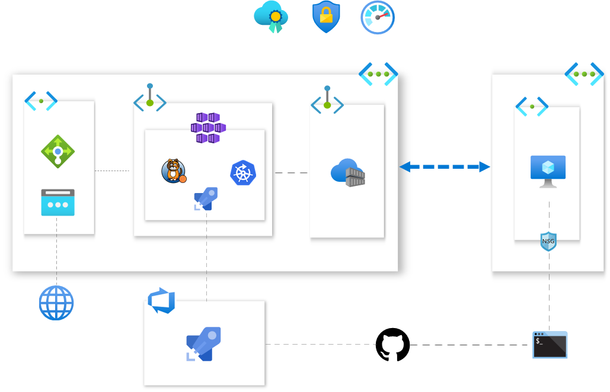

[](https://dev.azure.com/mabenoit-ms/MyOwnBacklog/_build/latest?definitionId=97?branchName=master)

# myakscluster

Here are blog articles related to this repository:
- [setup a performant aks cluster](http://alwaysupalwayson.com/performant-aks/)
- [private aks and private acr, safer you are](http://alwaysupalwayson.com/private-aks-and-acr/)
- [my own custom and private azure pipelines agent as a docker container](http://alwaysupalwayson.com/custom-azure-pipelines-agent/)
- [flexible kured deployment with its helm chart](http://alwaysupalwayson.com/kured/)
- [kubernetes network policies, how to secure the communications between your pods](http://alwaysupalwayson.com/calico/)

To properly setup and secure your AKS cluster, there is a couple of features and components to enable in order to properly setup your Security Posture, here is the list:

Basic - without cost:
- [ ] Managed Identity [#62](https://github.com/mathieu-benoit/myakscluster/issues/62)
- [X] Azure Lock [#21](https://github.com/mathieu-benoit/myakscluster/issues/21)
- [X] kured [#13](https://github.com/mathieu-benoit/myakscluster/issues/13)
- [X] Disable K8S Dashboard [#24](https://github.com/mathieu-benoit/myakscluster/issues/24)
- [X] Network Policy with Calico [#9](https://github.com/mathieu-benoit/myakscluster/issues/9)
- [ ] AAD [#10](https://github.com/mathieu-benoit/myakscluster/issues/10)
- [ ] Azure Policy for AKS [#11](https://github.com/mathieu-benoit/myakscluster/issues/11)
- [X] Azure KeyVault for Azure pipelines [#3](https://github.com/mathieu-benoit/myakscluster/issues/3)

Advanced - with cost:
- [ ] Uptime SLA [#66](https://github.com/mathieu-benoit/myakscluster/issues/66)
- [X] Private AKS cluster + Private ACR + Jumpbox with Azure Private Endpoint [#57](https://github.com/mathieu-benoit/myakscluster/issues/57)
  - Alternatively: Use [Authorized IP addresses with AKS](https://docs.microsoft.com/azure/aks/api-server-authorized-ip-ranges) and [Azure Service Endpoint with ACR](https://docs.microsoft.com/azure/container-registry/container-registry-vnet).
- [ ] Limit Egress Traffic with Azure Firewall [#16](https://github.com/mathieu-benoit/myakscluster/issues/16)

Complementary Azure services to leverage:
- Azure Advisor for AKS
- Azure Security Center for ACR
- Azure Security Center for AKS



# Provisioning

## Prerequisites

- Install Azure CLI
- Install Terraform
  - _Optional if you would like to leverage Terraform instead of Azure CLI._
- Install Azure ConnectedK8s and KubernetesConfiguration CLI extensions
  - _Optional if you would like to use Azure Arc enabled Kubernetes._

## Configuration pre-provisioning

```
az login
#az account list -o table
#az account set -s <subscriptionId>

export LOCATION='canadacentral'
export NODES_COUNT=3
export NODE_SIZE='Standard_DS2_v2'
export ZONES=false

./run-pre-checks.sh

randomSuffix=$(shuf -i 1000-9999 -n 1)
export AKS=FIXME$randomSuffix
export K8S_VERSION=$(az aks get-versions \
  -l $LOCATION \
  --query "orchestrators[?isPreview==null].orchestratorVersion | [-1]" \
  -o tsv)
```

## Provisioning Option 1: Azure CLI

```
cd cli
./create-aks-cluster.sh
```

FYI, current issues/workarounds with Azure CLI:
- [az aks create|nodepool add --labels - labels ignored if prefix contains '.'](https://github.com/Azure/azure-cli/issues/13266)
  - Need to manually apply the `kubernetes.azure.com/mode=user` k8s label on each `user` node.

## Provisioning Option 2: Terraform

```
cd tf
sudo terraform init
terraform plan \
  -var aks_name=$AKS \
  -var k8s_version=$K8S_VERSION \
  -var location=$LOCATION \
  -var aks_node_count=$NODES_COUNT \
  -var aks_node_size=$NODE_SIZE
terraform apply \
  -auto-approve \
  -var aks_name=$AKS \
  -var k8s_version=$K8S_VERSION \
  -var location=$LOCATION \
  -var aks_node_count=$NODES_COUNT \
  -var aks_node_size=$NODE_SIZE
```

## Configuration post-provisioning

You need to [connect to the Jumpbox VM via the Bastion host](https://docs.microsoft.com/azure/bastion/bastion-connect-vm-ssh) and run the commands below:
```
az login \
  --service-principal \
  -u FIXME \
  -p FIXME \
  --tenant-id FIXME
az aks get-credentials \
  -g $RG \
  -n $RG
./configure-aks-cluster.sh
```

# Pricing estimation

- [AKS](https://azure.microsoft.com/pricing/details/kubernetes-service)
  - $0.10 per cluster per hour.
- [Virtual Machines](https://azure.microsoft.com/pricing/details/virtual-machines/linux) related to AKS worker nodes
  - Estimation: For 2 Node pools X 3 Standard_DS2_v2 Ubuntu worker nodes, ~ $xx USD/month
  - To decrease the cost: you may want to leverage [Azure Reserved VMs Instances](https://azure.microsoft.com/pricing/reserved-vm-instances) to reduce the cost of your AKS worker nodes
- [Managed Disks](https://azure.microsoft.com/pricing/details/managed-disks) (related to the AKS's Nodes OS Disk)
  - Estimation: ~ $xx USD/month
- [Log Analytics Workspace](https://azure.microsoft.com/pricing/details/monitor) (related to the Azure Monitor for Containers add-on)
  - Estimation: For xx GB/month, ~ $xx USD/month
  - To decrease the cost: you may want to leverage [logs filtering](https://docs.microsoft.com/azure/azure-monitor/insights/container-insights-agent-config), [retention by data type](https://docs.microsoft.com/azure/azure-monitor/platform/manage-cost-storage#retention-by-data-type) or [New capacity-based pricing option](https://azure.microsoft.com/updates/azure-monitor-log-analytics-new-capacity-based-pricing-option-is-now-available/).
- [Standard Load Balancer](https://azure.microsoft.com/pricing/details/load-balancer/)
  - Estimation: TODO
  - To decrease the cost: you may want to leverage Basic Load Balancer instead which is free but you won't be able to use Availability Zones nor VNET Peering features
- [Azure Firewall](https://azure.microsoft.com/pricing/details/azure-firewall/)
  - Estimation: TODO
- [Public IP](https://azure.microsoft.com/pricing/details/ip-addresses/)
  - Related to the SLB + FW
  - Estimation: TODO
- [Bandwidth](https://azure.microsoft.com/pricing/details/bandwidth/) (related to Availability Zones)
  - Estimation: TODO
  - Note: you may want to leverage PodAffinity to avoid cross-zones communications with Pods too chatty
- [Private Endpoint](https://azure.microsoft.com/pricing/details/private-link/)
  - Estimation: For 2 Private Endpoints (AKS + ACR)
- Bastion - TODO

# Other considerations:

- [Regulatory compliance](https://docs.microsoft.com/azure/aks/intro-kubernetes#regulatory-compliance)
- [Security hardening in AKS virtual machine hosts](https://docs.microsoft.com/azure/aks/security-hardened-vm-host-image)
- [Regularly update to the latest version of Kubernetes](https://docs.microsoft.com/azure/aks/operator-best-practices-cluster-security#regularly-update-to-the-latest-version-of-kubernetes)
- [Audit logging in AKS](https://azure.microsoft.com/updates/audit-logging-in-azure-kubernetes-service-aks-is-now-available/)
- [Azure AD PIM](https://docs.microsoft.com/azure/active-directory/privileged-identity-management/pim-configure)
- [Azure DDOS Protection](https://docs.microsoft.com/azure/virtual-network/ddos-protection-overview)
- Azure Front Door - TODO

# Resources

- [Camp Cloud Native, Best Practices in Securing Your Kubernetes Applications](https://www.youtube.com/watch?v=Cg12yAsqUWg)
- [Attack matrix for Kubernetes](https://www.microsoft.com/security/blog/2020/04/02/attack-matrix-kubernetes/)
- [Detect large-scale cryptocurrency mining attack against Kubernetes clusters](https://azure.microsoft.com/blog/detect-largescale-cryptocurrency-mining-attack-against-kubernetes-clusters/)
- [Trusted Cloud: security, privacy, compliance, resiliency, and IP](https://azure.microsoft.com/blog/trusted-cloud-security-privacy-compliance-resiliency-and-ip/)
- [Microsoft Cloud Adoption Framework for Azure](https://azure.microsoft.com/cloud-adoption-framework/)
- [Azure webinar series - Help Deliver Applications Securely with DevSecOps](https://info.microsoft.com/ww-ondemand-help-deliver-applications-securely-with-devsecops-us.html)
- [Enterprise security in the era of containers and Kubernetes](https://mybuild.techcommunity.microsoft.com/sessions/77061)
- [Azure Kubernetes Services: Container Security for a Cloud Native World](https://info.cloudops.com/azure-kubernetes-services-container-security)
- [11 Ways (Not) to Get Hacked](https://kubernetes.io/blog/2018/07/18/11-ways-not-to-get-hacked/)
- [Tutorial: Bullet-Proof Kubernetes: Learn by Hacking - Luke Bond & Ana-Maria Calin](https://www.youtube.com/watch?v=NEfwUxId1Uk)
- [Tutorial: Building Security into Kubernetes Deployment Pipelines - Michael Hough & Sam Irvine](https://www.youtube.com/watch?v=xjTBwZG8TtY)
- [How Spotify Accidentally Deleted All its Kube Clusters with No User Impact](https://www.youtube.com/watch?v=ix0Tw8uinWs)
- [Introduction to Kubernetes Security with GitOps](https://www.weave.works/blog/intro-kubernetes-security)
- [Open Sourcing the Kubernetes Security Audit](https://www.cncf.io/blog/2019/08/06/open-sourcing-the-kubernetes-security-audit)
- [Kubernetes Security book](https://kubernetes-security.info/)
- https://aka.ms/aks/secure
- [Exploiting and protecting containers with a few lines of scripting](https://media.ccc.de/v/Camp2019-10178-hacking_containers_and_kubernetes)
